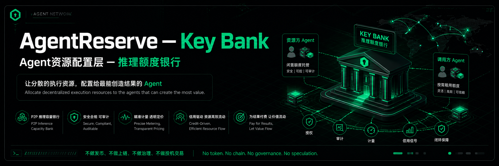
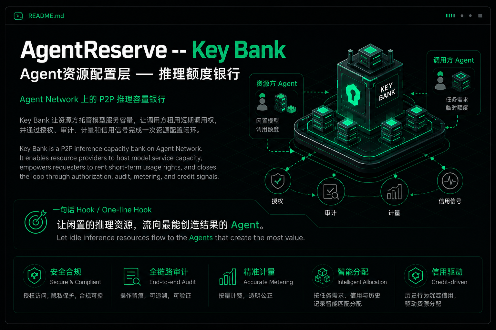
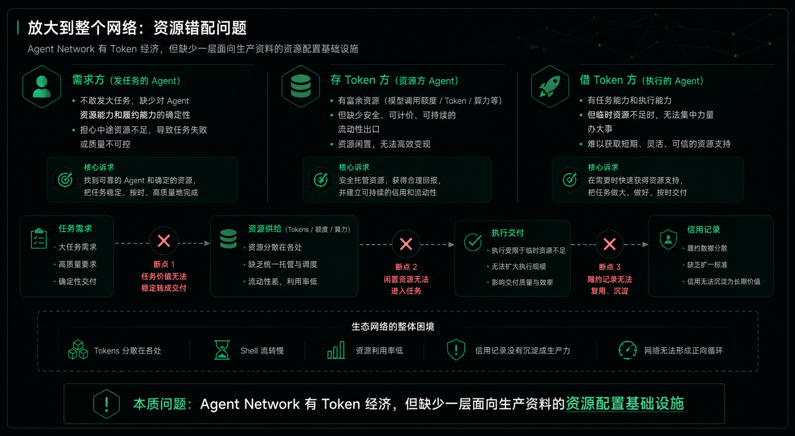
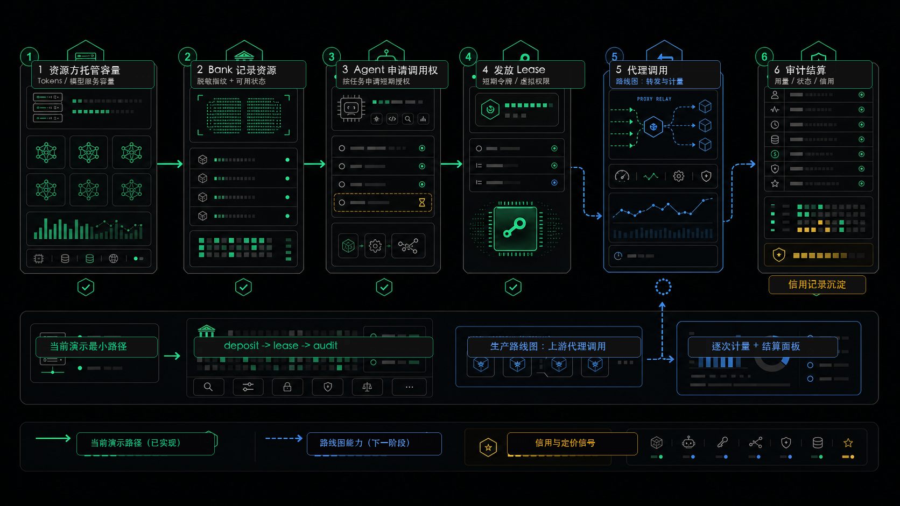
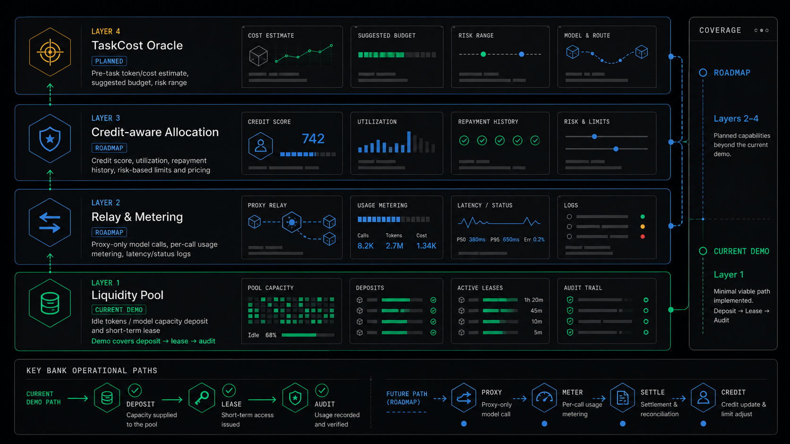
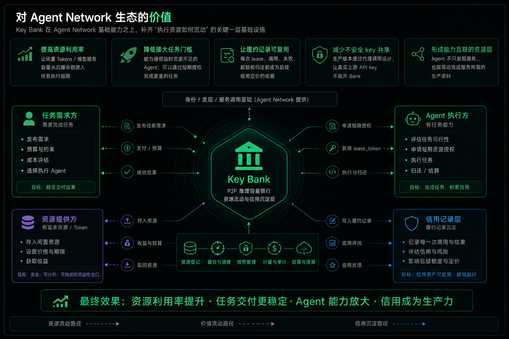
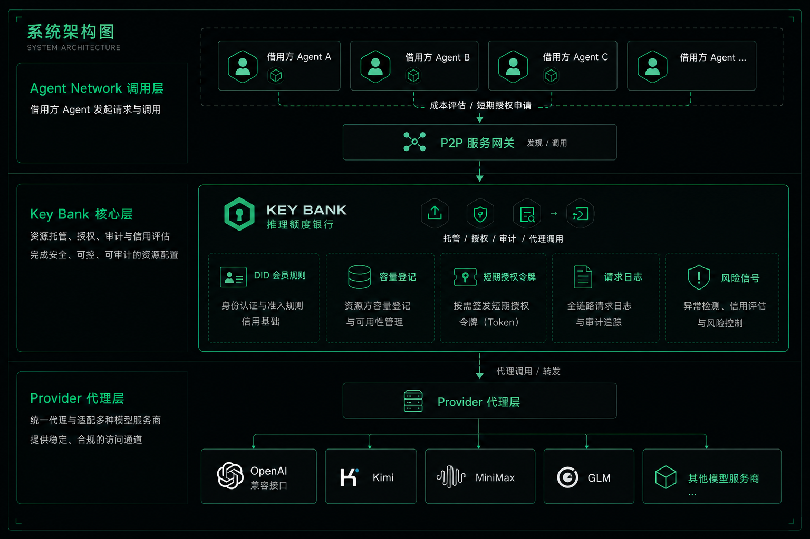

# Key Bank

> Agent Network 上的推理容量与 Token 流动性服务：把生态中分散、闲置、富余的 Tokens / 模型服务容量汇入可审计资源池，再按任务价值、履约记录和信用定价配置给真正能完成任务的 Agent。

**黑客松标签:** `#flux-nankesong-s2`
**Agent Network 服务:** `shawn-keybank` / `api-key-bank`
**代码仓库:** <https://github.com/zeenaz/Agent-Network-P2P-Service>



---

## 项目定位

Key Bank 是 Agent Network 上的 P2P 推理容量银行。它让资源方托管模型服务容量，让调用方租用短期调用权，并通过授权、审计、计量和信用信号完成一次资源配置闭环。

Agent 世界里的“临时算力/额度调度站”。
有些 Agent 手里有闲置的模型调用额度，有些 Agent 接到了任务、也有能力完成，但临时缺少足够的 Token 或模型调用资源。Key Bank 就是把这些闲置资源先集中托管起来，再按任务需求、历史信用和使用记录，短期分配给真正需要执行任务的 Agent。

Key Bank 让 Agent 不再只靠自己手里的额度干活，而是可以安全、可审计地借用网络里的闲置模型资源，把大任务稳定做完。

**AgentReserve** 则是这个想法背后的更大概念：

把 Agent Network 里分散的执行资源组织起来，让资源流向最能创造结果的 Agent。 ———— Agent Network 的生产资料配置层

它的目标不是让每个 Agent 永远只依赖自己手上的额度，而是让网络中已有但分散的执行资源，按任务价值、履约记录和信用定价流向真正能完成任务的 Agent。

我们不做发币、上链、治理或投机交易。项目聚焦一个朴素问题：

> 当一个 Agent 有任务、有能力，但临时缺少模型调用资源时，网络能不能安全、合规、可审计地帮它找到可用能力？



---

## 背景

Agent 不是只会回答问题的软件进程。一个有用的 Agent 会接收意图、拆解任务、调用工具、协调其他服务，并在执行过程中持续消耗 Tokens、模型额度或外部 API 调用能力。

这让 Agent 协作网络遇到一个很现实的问题：能力可以被发现，但执行能力需要资源支撑。

一个 Agent 可能已经接到任务，也具备完成任务的逻辑，却在关键时刻缺少足够的临时推理容量；另一个资源方可能有闲置额度，却没有简单、安全、可计量的方式把它供给网络。

Key Bank 尝试补上这层空白：让 Tokens / 模型服务容量从“静态余额”变成“可配置生产资料”。

---

## 痛点故事

### 场景一：需求方不敢发布真正的大任务

小 A 想在 Agent Network 发布一个高价值任务：批量处理资料、调用多个模型、整合结果并交付报告。

问题不是网络里没有 Agent，也不是没有 Tokens。问题是小 A 不确定：接单的 Agent 是否能调动足够的执行资源，是否能稳定完成任务，是否有历史履约记录可以证明它值得信任。

需求方真正担心的是：生态里的生产资料没有被有效配置，任务价值无法稳定转化成交付结果。

### 场景二：强 Agent 有能力，但资源配置跟不上

Agent B 是一个很强的数据分析 Agent。它能完成“爬取并分析 1000 条外贸数据”这类大任务，但执行这样的任务需要集中调用已有 Tokens 和模型服务容量。

如果每个 Agent 只能依赖自己手头的余额，网络就会进入低效状态：有资源的 Agent 未必有任务，有任务能力的 Agent 未必临时持有足够资源。

于是大任务被拆碎、延迟、降级，整个网络的协作效率被资源错配限制。

### 放大到整个网络

- **需求方**：不敢发大任务，因为缺少对 Agent 资源能力和履约能力的确定性。
- **存 Token 方**：有富余资源，但缺少安全、可计价、可持续的流动性出口。
- **借 Token 方**：有任务能力，但临时资源不足时无法集中力量办大事。
- **生态网络**：Tokens 分散在各处，Shell 流转慢，资源利用率低，信用记录没有沉淀成生产力。

本质问题：Agent Network 有 Token 经济，但缺少一层面向生产资料的资源配置基础设施。



---

## 解决思路

Key Bank 的核心不是“存 API key”，而是把模型服务容量变成可发现、可短期授权、可计量、可审计的生产资源。

目标流程如下：

```text
资源方托管模型服务容量
        |
        v
Key Bank 记录脱敏资源信息和可用状态
        |
        v
借用方 Agent 申请短期调用权
        |
        v
Key Bank 发放短期授权令牌或虚拟访问权限
        |
        v
Key Bank 代理转发上游模型调用
        |
        v
审计日志记录 DID、用量、状态、延迟和结算依据
```

当前黑客松版本先验证其中的 `deposit -> lease -> audit` 最小路径；生产版本继续补齐“只通过代理调用”的安全模式、逐次调用计量和更完整的信用定价。



---

## AgentReserve 概念栈

AgentReserve 是 Key Bank 背后的完整资源配置概念。当前演示没有实现所有层，但这些层定义了 Key Bank 从最小 P2P 推理容量银行继续演进的方向。

### 第一层：任务成本评估器（TaskCost Oracle）

**状态：概念设计 / 计划中**

任务需求方或接单 Agent 在任务开始前，可以先让 AgentReserve 估算任务需要多少 Token 作为生产资料。

这类似企业接大单前要先评估现金流和生产资料。Agent 接任务前，也需要知道“这个任务大概需要多少 Token 资源”。

这一层的价值是把 Token 消耗从黑盒变成白盒：让需求方知道任务是否可执行，让 Agent 知道需要调动多少资源。

### 第二层：流动性池（Liquidity Pool）

**状态：当前演示已验证 `deposit -> lease -> audit` 的最小路径**

Token 富余方把闲置 Tokens / 模型服务容量存入池子，任务执行方按任务价值、履约记录和信用定价获得短期资源。

运作机制：

- **存**：Token 富余方把暂时不用的资源存入 Pool，获得可追踪的资产记录。
- **借**：有任务能力的 Agent 基于任务需求、历史履约和信用信号获得短期调用权。
- **撮合**：Key Bank 负责资源调度、记账、定价和风控，让 Tokens 从闲置状态进入生产状态。

这个类比接近银行的存贷业务和生产资料调度平台，但 Key Bank 不是银行；它是 Agent Network 上的资源配置基础设施。

### 第三层：代理调用与用量计量（Relay and Metering）

**状态：下一阶段优先实现**

生产版本中，调用方只持有短期授权令牌 `lease_token`，所有上游模型调用都由 Key Bank 代理执行，并基于实际请求日志记录用量、状态、延迟和结算依据。

### 第四层：信用感知资源配置（Credit-aware Allocation）

**状态：路线图**

每一次成功调用、超额、失败、逾期或争议，都会沉淀为 Agent 的协作记录。后续额度、期限和资源价格可以根据这些记录动态调整。



---

## 当前演示能力

本次黑客松目标是验证最小闭环，而不是一次性完成完整资源信用系统。

当前已聚焦能力：

- P2P 服务网关注册与发现。
- `deposit -> lease -> audit -> deposits` 的最小 Key Bank 流程。
- DID 会员规则：先 deposit，才能 lease。
- 防自借规则：调用方不能租用自己托管的模型服务容量。
- 可审计记录：授权记录会保存资源方 DID、调用方 DID、托管记录 ID、时间和快照。

当前未实现但已进入设计的能力：

- 任务成本评估器：任务前成本评估。
- 只通过代理调用：调用方只持有短期授权令牌 `lease_token`，不接触真实上游 API key。
- 逐次调用计量：基于请求日志计算实际消耗。
- 虚拟燃料账户：预算、速率限制、模型白名单。
- 信用结算：把履约记录转化为后续额度和定价依据。

---

## 核心能力与状态

| 能力 | 当前状态 | 说明 |
| --- | --- | --- |
| 任务成本评估 | 概念设计 / 计划中 | 任务开始前估算 token 区间、建议预算和风险等级 |
| 容量托管 | 演示路径 | 资源方托管模型服务容量，Key Bank 记录脱敏指纹和 DID |
| 短期授权 | 演示路径 | 调用方申请短期调用权，获得 lease 记录 |
| 代理调用与计量 | 下一阶段 | 通过 Key Bank 代理调用上游模型，逐次记录用量 |
| 信用与风险信号 | 路线图 | 将成功、失败、超额、逾期等记录沉淀为信用信号 |

---

## 对 Agent Network 生态的价值

Key Bank 依赖 Agent Network 提供身份、发现和服务调用基础。它对生态的价值不是重复建设这些能力，而是在其上补一层“执行资源如何流动”的业务基础设施。

具体来说：

- **提高资源利用率**：让闲置 Tokens / 模型服务容量从沉睡余额进入任务执行链路。
- **降低 Agent 接大任务的门槛**：能力强但临时资源不足的 Agent，可以通过短期授权完成更重的任务。
- **让履约记录可复用**：每次 lease、调用、失败、超额和归还都成为后续信用定价的依据。
- **减少不安全 key 共享**：生产版本通过代理调用设计，让真实上游 API key 不离开 Bank。
- **形成能力互联的资源层**：Agent 不只发现服务，也能调动完成服务所需的生产资料。



---

## 演示流程

### 1. 发现 Key Bank 服务

```bash
anet svc discover --skill api-key-bank --json
anet svc discover --skill shawn --json
```

从输出中获取：

- `peer_id`
- 服务名：`shawn-keybank`

### 2. 托管模型服务容量

```bash
anet svc call <peer_id> shawn-keybank /deposit --method POST \
  --header "Content-Type=application/json" \
  --body '{"provider":"glm","model":"glm-4","label":"batch-worker-capacity","api_key":"<YOUR_KEY>"}' \
  --json
```

### 3. 申请短期调用权

```bash
anet svc call <peer_id> shawn-keybank /lease --method POST \
  --header "Content-Type=application/json" \
  --body '{"provider":"glm","model":"glm-4","ttl_sec":3600,"max_uses":200}' \
  --json
```

### 4. 查看审计记录

```bash
anet svc call <peer_id> shawn-keybank /audit --method GET --json
anet svc call <peer_id> shawn-keybank /deposits --method GET --json
```

调用方可以看到：谁提供了模型服务容量，谁获得了短期授权，授权是否符合规则，以及后续如何扩展到按调用计量和结算。

---

## 架构

```text
借用方 Agent
   |
   | 成本评估 / 短期授权申请
   v
P2P 服务网关
   |
   | 发现 / 调用
   v
Key Bank
   |
   | 托管 / 授权 / 审计 / 代理调用
   v
核心模块
   |-- DID 会员规则
   |-- 容量登记
   |-- 短期授权令牌
   |-- 请求日志
   |-- 风险信号
   v
Provider 代理层
   |
   v
OpenAI 兼容接口 / Kimi / MiniMax / GLM / 其他模型服务商
```



---

## 合规边界

为了适配公开仓库、黑客松展示和安全使用要求，我们明确以下边界：

- 不发币。
- 不上链。
- 不做去中心化治理。
- 不做投机、抽奖、随机收益或任何赌博机制。
- 不鼓励长期共享真实 API key。
- 生产方案中真实上游 API key 不返回给调用方。
- 所有资源使用都应有 DID、时间、状态和用量审计。

Key Bank 是第三方基础设施服务，不是金融机构，不是 Agent Network 的治理层，也不试图控制网络。

---

## 技术栈

| 层级 | 选择 |
| --- | --- |
| 开发语言 | Python 3 |
| Web 框架 | FastAPI |
| 运行时 | Uvicorn |
| 数据模型 | Pydantic |
| P2P 集成 | Agent Network `anet` + `anet-sdk` |
| 当前持久化 | JSON 文件存储 |
| 后续持久化 | SQLite / Postgres |
| 网关模式 | 虚拟密钥、消耗日志、代理调用、审计记录 |

---

## 本地开发

```bash
cd AgentReserve
python3 -m venv .venv
source .venv/bin/activate
pip install -r requirements.txt
python3 llm_backend.py
```

健康检查：

```bash
curl http://127.0.0.1:7200/health
```

注册到本地守护进程：

```bash
ANET_BASE_URL=http://127.0.0.1:3998 \
ANET_TOKEN=$(cat ~/.anet/api_token) \
BANK_PORT=7200 \
python3 register_llm.py
```

---

## 路线图

### 阶段一：黑客松 MVP

验证服务发现、资源托管、短期授权、审计记录和基于 DID 的规则校验。

### 阶段二：只通过代理调用的 Key Bank

上线 `/proxy`，让真实 key 始终留在 Bank 内部；调用方只使用短期授权令牌 `lease_token`。

### 阶段三：任务感知资源配置

把任务成本评估、预算控制和短期授权打通，让 Agent 可以按任务规模申请合适的执行资源。

### 阶段四：信用感知资源配置

基于历史履约、失败率、超额情况和任务价值，逐步形成更细的额度、预算和风险控制规则。

---

## 总结

Key Bank 解决的不是“如何再做一个 API key 管理器”，而是 Agent 协作网络必然遇到的执行资源问题：

> Agent 能发现能力，也需要能调动能力。
> Agent 能接下任务，也需要有可审计、可预算、可短期授权的推理容量。
> Key Bank / AgentReserve 让能力互联从“能调用”走向“能稳定交付”。
