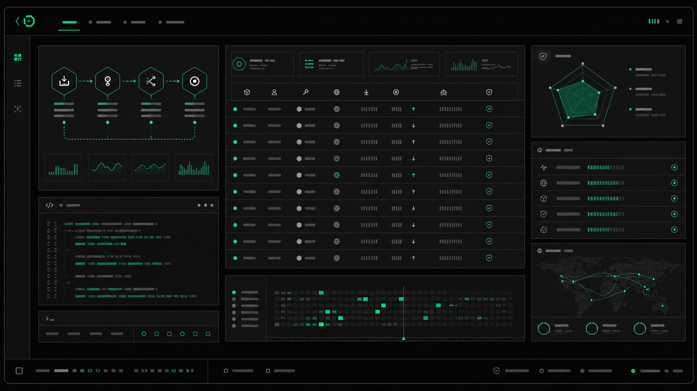

# Key Bank design.md Exploration

Date: 2026-05-03

## Why We Did This

We explored `design.md` as the project-level design contract for Key Bank.
The goal was to give future UI and style generation a stable visual direction
instead of relying on one-off prompts.

The project README positions Key Bank as an API Key Bank for Agent Network fuel:
agents can deposit available key capacity, lease one-time access, proxy requests
through a relay, and settle usage through a bank-style ledger. That tone calls
for developer infrastructure credibility plus financial/accounting clarity.

## References Reviewed

- `README.md` for the project's product tone and public scope.
- `https://getdesign.md/what-is-design-md` for the `design.md` concept.
- `https://stitch.withgoogle.com/docs/design-md/overview` for how design
  contracts guide AI-generated UI.
- `https://github.com/voltagent/awesome-design-md` for existing design style
  references.

## Style Options Considered

We narrowed the direction to three candidates:

| Option | Source | Fit |
| --- | --- | --- |
| Agent Fuel Terminal | VoltAgent | Best fit for Agent Network, relay, lease, fuel, and developer-console energy. |
| Institutional Key Bank | Coinbase | Best fit for banking clarity, ledger tables, credit tiers, and audit trust. |
| Calm Operator Console | Warp | Strong fit for a quiet, controlled, dark operator experience. |

## Decision

We selected a VoltAgent-inspired base with Key Bank customization:

- Keep the carbon-black canvas and emerald signal accent.
- Preserve the developer terminal / agent infrastructure feel.
- Add Coinbase-style ledger discipline for settlement, credit, and audit views.
- Avoid generic crypto, wallet, exchange, or pastel AI visual language.

This became the project design contract in `DESIGN.md`.

## Generated Image Test

After writing `DESIGN.md`, we tested whether the style could produce a README
hero image that matched the chosen direction.

### Prompt Summary

The image generation prompt asked for:

- A wide README hero banner.
- A carbon-black developer infrastructure dashboard.
- Emerald signal accents.
- A central ledger table preview.
- A `Deposit -> Lease -> Proxy -> Settle` flow visualization.
- Credit rating and relay health panels.
- A restrained, bank-grade audit feel.

It explicitly avoided:

- Crypto coins, wallets, and blockchain imagery.
- Generic AI brain imagery.
- Decorative gradient orbs and pastel AI gradients.
- People, cartoon agents, and excessive glow.
- Readable fake UI text.

## Result

The generated image successfully matched the target direction:

- The overall mood reads as dark Agent infrastructure rather than generic
  fintech.
- Emerald signal accents communicate fuel, routing, and live relay behavior.
- The dashboard composition supports the Key Bank story: ledger, flow,
  credit, and audit can all coexist in one product surface.
- The visual style is suitable for a README hero and can guide future UI
  mockups.

## Follow-Up Opportunities

- Add the hero image to `README.md` once the final placement is chosen.
- Generate a second asset focused only on the `Deposit -> Lease -> Proxy ->
  Settle` lifecycle for docs.
- Generate dashboard-specific reference mockups for ledger, credit, lease
  detail, and audit trail pages.
- Convert the strongest UI motifs from this image into actual frontend
  components when the product UI work begins.
